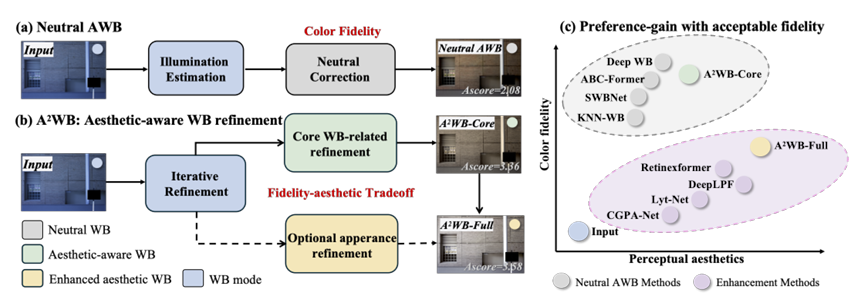
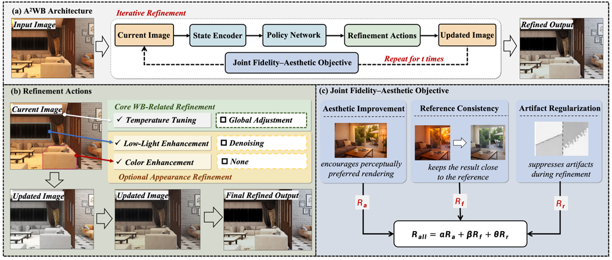

<div align="center">

# A²WB

### Aesthetic-Aware Sequential Color Correction

**Anonymous Authors**

Anonymous Institution

[](ACM_MM_2026_A2WB_camera_ready.pdf)
[](https://www.python.org/)
[](https://pytorch.org/)

**English** · [[简体中文](README_ZH.md)]

</div>

A²WB reformulates automatic white balance as a sequential aesthetic-aware color correction problem. A lightweight policy network iteratively selects one of six pixel-level refinement actions (No-op, Denoise, Enhance, Colder AWB, Warmer AWB, Low-light enhancement) guided by a joint fidelity–aesthetic objective. This repository provides code for stage-two training, single-image inference, and an environment/model smoke test.

<p align="center">
  
</p>
<p align="center"><em>A²WB converts a color-cast image into an aesthetically preferred rendering through iterative WB refinement, balancing color fidelity and perceptual aesthetics.</em></p>

## Method

The released implementation runs the policy network for **t** steps (default 10) and at each step assigns one of 6 actions to every pixel.

<p align="center">
  
</p>
<p align="center"><em>Architecture of A²WB.</em></p>

- **State Encoder:** dilated convolutions on the current LAB image with the previous ConvGRU hidden state.
- **Policy Network:** ConvGRU cell + dilated conv heads producing a 6-channel action map.
- **Value Head:** parallel dilated conv stack estimating the per-pixel state value for A3C.
- **Action Bank:**
  - 0 — No-op
  - 1 — Denoise (CBDNet)
  - 2 — Enhance (DeepLPF)
  - 3 — AWB Colder (DeepWB − t blended into input)
  - 4 — AWB Warmer (DeepWB − s blended into input)
  - 5 — Low-light enhancement (SCINet)
- **Joint Fidelity–Aesthetic Objective:**
  R_all = α · R_a + β · R_f + θ · R_r
  - R_a — FMMNet aesthetic improvement reward.
  - R_f — Reference consistency reward (MSE drop vs. target AWB).
  - R_r — Gradient-magnitude artifact regularization.

## Installation

```bash
conda create -n a2wb python=3.9 -y
conda activate a2wb
pip install -r requirements.txt
```

## Dataset and Weights

Download the A²WB training pairs, FMMNet aesthetic checkpoint, and the released policy network weight:

- [Google Drive](https://drive.google.com/file/d/1R_ubgxpWC0KA8THDXdcf5FMqD2Ngm6id/view?usp=sharing)

The downloaded archive contains:

```text
weights/
├── pixelrl_seg/best_model.pt        # released A²WB policy network
├── deepwb/net_awb.pth               # DeepWB white-balance model
├── deepwb/net_t.pth                 # DeepWB cooler-tone model
├── deepwb/net_s.pth                 # DeepWB warmer-tone model
├── deeplpf/deeplpf_adobe_dpe.pt     # DeepLPF image-enhancement model
└── cbdnet/checkpoint.pth.tar        # CBDNet denoising checkpoint

action/SCINet/weights/medium.pt      # SCINet low-light model
action/FMMNet/*.pth                  # FMMNet aesthetic scoring model
```

Organize the downloaded files as follows:

```text
A2WB-Aesthetic-Aware-Sequential-Color-Correction/
├── weights/
│   ├── pixelrl_seg/best_model.pt
│   ├── deepwb/
│   ├── deeplpf/
│   └── cbdnet/
├── src/action/SCINet/weights/medium.pt
└── src/
```

## Inference

Run inference on a single image (no segmentation):

```bash
python src/infer_cli.py \
  --input path/to/input.png \
  --output result.png
```

With semantic segmentation masks (stored as a Python pickle of per-class numpy arrays):

```bash
python src/infer_cli.py \
  --input path/to/input.png \
  --seg path/to/mask_list.pkl \
  --output result_seg.png
```

Full options:

```bash
python src/infer_cli.py \
  --input path/to/input.png \
  --seg path/to/mask_list.pkl \
  --output result.png \
  --steps 10 \
  --device cuda:0 \
  --weights weights/pixelrl_seg/best_model.pt
```

| Arg | Description | Default |
|-----|-------------|---------|
| `--input, -i` | Input image path | (required) |
| `--output, -o` | Output image path | `result.png` |
| `--seg, -s` | Segmentation mask `.pkl` | None |
| `--steps` | Number of RL steps | 10 |
| `--device, -d` | Device (`cuda:0`, `cpu`) | auto |
| `--weights, -w` | Policy network weights | `weights/pixelrl_seg/best_model.pt` |

## Training

The released training entry point loads paired color-cast/AWB images, runs the A3C trainer for `--steps` global iterations, and saves checkpoints to the directory configured in `src/config.py`.

```bash
python src/train_cli.py \
  --resume checkpoints/last_epoch.pt
```

Training hyperparameters (path, learning rates, reward weights, batch size, etc.) live in `src/config.py`. The released defaults assume:

```text
DATA_ROOT/cast/    # color-cast source images
DATA_ROOT/awb/     # ground-truth auto-white-balanced targets
DATA_ROOT/train/cast.txt
DATA_ROOT/train/awb.txt
DATA_ROOT/test/cast.txt
DATA_ROOT/test/awb.txt
```

Training objective:

```text
total_loss = policy_loss_weight * policy_loss
           + value_loss_weight   * value_loss
           + entropy_loss_weight * policy_entropy
reward     = rebuild_reward + 0.1 * aes_reward
```

`REWARD_AES_COEF`, `POLICY_LOSS_COEF`, `VALUE_LOSS_COEF`, `ENTROPY_COEF`, `GRAD_CLIP`, `BATCH_SIZE`, and `TRAIN_STEPS` are all defined in `src/config.py`.

### Training smoke test

To check only environment, model instantiation, and forward/backward steps (no dataset, no sub-models):

```bash
python src/smoke_test.py --train-step
```

Without backward/optimizer step:

```bash
python src/smoke_test.py
```

## Project Structure

```text
src/
├── neuralnet.py             # PixelRL policy/value network (inference)
├── State.py                 # inference state manager (segmentation-aware step)
├── infer_cli.py             # single-image inference entry point
├── net.py                   # training PixelRL network (FeatureExtractor/PolicyHead/ValueHead)
├── train_state.py           # training StateManager
├── trainer.py               # A3C trainer with reward composition
├── train_cli.py             # stage-two training entry point
├── config.py                # hyperparameter configuration
├── common.py                # training utilities (PSNR, SSIM, tensor<->PIL)
├── data_loader.py           # AWB paired dataset
├── smoke_test.py            # environment and model checks
├── utils/
│   └── common.py            # inference utilities (BGR<->LAB, action logging)
└── action/
    ├── func_processor.py    # DeepWB / CBDNet / DeepLPF / SCINet wrappers
    ├── aesReward.py         # FMMNet-based aesthetic reward (training only)
    ├── gradLoss.py          # gradient-magnitude artifact regularization
    ├── CBDNet/              # CBDNet denoising
    ├── DeepLPF/             # DeepLPF image enhancement
    ├── DeepWB/              # DeepWB white balance
    ├── SCINet/              # SCINet low-light enhancement
    └── FMMNet/              # FMMNet aesthetic scoring (training only)
```

## Notes

- GPU is recommended for faster inference. CPU is also supported.
- Segmentation masks are stored as Python pickle files containing a list of numpy arrays (one per semantic class), each shaped `(H, W)`.
- The first inference step is slower due to sub-model loading. Subsequent inferences reuse loaded models.
- The inference code under `src/` is the released testing code; the training code under `src/config.py`, `src/trainer.py`, `src/train_cli.py`, `src/data_loader.py`, `src/net.py`, `src/train_state.py`, and `src/action/aesReward.py`, `src/action/gradLoss.py`, `src/action/FMMNet/` is extracted from the original training codebase for reference and is not re-validated locally.

## Citation

```bibtex
@inproceedings{a2wb2026,
  title     = {A²WB: Aesthetic-Aware Sequential Color Correction},
  author    = {Anonymous Authors},
  booktitle = {Proceedings of the 35th ACM International Conference on Multimedia},
  year      = {2026},
}
```